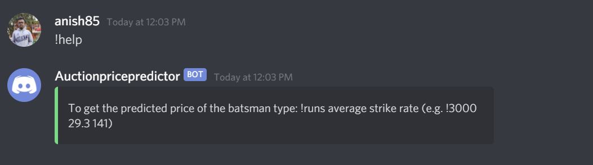
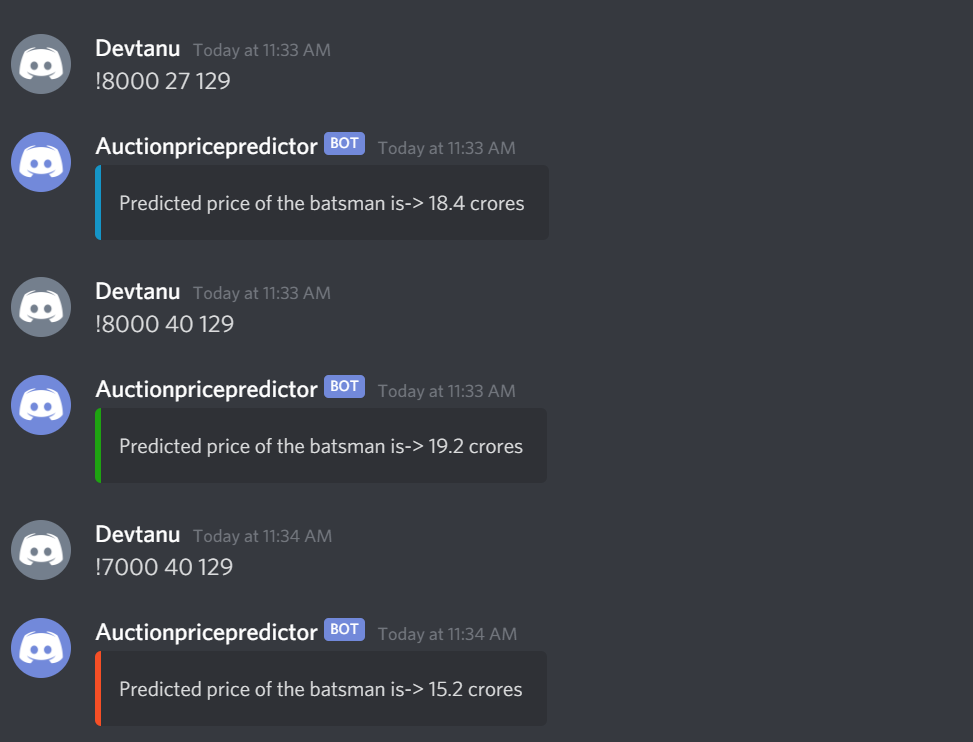

# Auctionpricebot
A discord bot which predicts the price of a batsman by the number of Runs scored by him , his batting average and his Strike Rate in the Indian Premier League(IPL). The model is trained using the data of the top 100 IPL Batsmen.
## Instructions
Create a Discord bot and get it's token. Follow the instructions [here](https://github.com/reactiflux/discord-irc/wiki/Creating-a-discord-bot-&-getting-a-token)!

Then create a .env file in the root directory and set your set your TOKEN there :

```TOKEN='<YOUR TOKEN>'```

Install the latest version of discord.py using pip install -U discord.py and install the other required packages. 

Run the bot using py -3 main.py (requires Python 3.7 or above)!

To get started, type ```!help``` to see the required command.

## Screenshots



